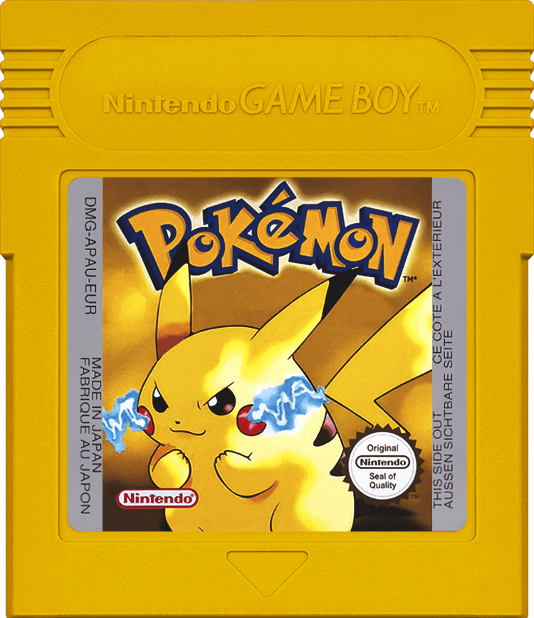

<div align="center">
  
</div>

# raracandy 🍬
A CLI tool to safely edit **Pokémon Gen 1** save files.

**Goal:** Edit `.sav` files from original cartridges (add items, modify money), recalculate checksums, and write back to hardware — **without touching ROMs**.

## Overview
**Supported:** Pokémon Yellow (Gen 1)
**Planned:** Red/Blue, PC items, party editor

**Features:** ✓ Bag items • ✓ Money • ✓ Save validation • ✓ Checksum recalculation

**Non-goals:** ROM modification, real-time memory editing, GameShark codes, piracy

## Installation & Workflow

```bash
git clone https://github.com/abravonunez/raracandy.git
cd raracandy
go build -o raracandy ./cmd/raracandy
```

**Hardware workflow:**
1. Dump save from cartridge to `yellow.sav` (using GBxCart RW / GB Operator)
2. Edit with raracandy → `yellow_mod.sav`
3. Write modified save back to cartridge
4. Play on real hardware

## Usage

```bash
# Verify save integrity (recommended first)
raracandy yellow verify pokemon_yellow.sav

# Inspect save contents
raracandy yellow inspect pokemon_yellow.sav

# Add single item
raracandy yellow add-item pokemon_yellow.sav \
  --item rare_candy --qty 99 --out modified.sav

# Add multiple items (batch mode - atomic, faster)
raracandy yellow add-items pokemon_yellow.sav \
  --item rare_candy --qty 99 \
  --item master_ball --qty 50 \
  --out modified.sav

# Set money
raracandy yellow set-money pokemon_yellow.sav \
  --amount 999999 --out modified.sav

# Preview changes (any command)
raracandy yellow add-item pokemon_yellow.sav \
  --item rare_candy --qty 99 --out modified.sav --dry-run
```

**Supported items:** `rare_candy`, `master_ball`, `ultra_ball`, `great_ball`, `poke_ball`, `potion`, `super_potion`, `hyper_potion`, `max_potion`, `full_restore`, `revive`, `max_revive`, and more

## Safety Features

**Built for reliability:**
- Never overwrites input files (requires `--out` flag)
- Automatic `.bak` backups with SHA256 verification
- Pre/post-modification integrity checks
- Game version detection
- Interactive confirmation (bypass with `--force`)
- Dry-run mode (`--dry-run`)
- Checksum validation before/after edits

**Confidence Level: 99%+** when following recommended workflow

## Technical Details

**Save Format:** 32 KB (4 banks × 8 KB), main data at 0x2000-0x3FFF
**Checksum:** 1 byte at 0x3523 (sum of 0x2598-0x3522, bitwise NOT)

**Key Offsets (Pokémon Yellow NA):**
- Bag: 0x25C9-0x25E1 (count + 20 items)
- Money: 0x25F3 (3 bytes, BCD encoded)

**References:** [Bulbapedia](https://bulbapedia.bulbagarden.net/wiki/Save_data_structure_(Generation_I)) • [Data Crystal](https://datacrystal.tcrf.net/wiki/Pokémon_Yellow/RAM_map)

## License & Disclaimer

MIT License - see [LICENSE](LICENSE)

Educational and personal use only. Operates on save files you own. No ROM distribution/modification. Pokémon is a trademark of Nintendo/Game Freak/The Pokémon Company.
